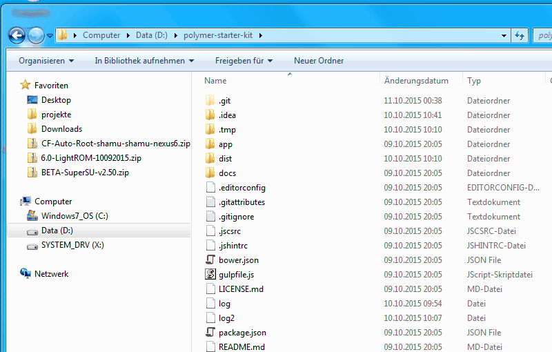

# Polymer Project How To Install On Windows 7 (x64)
# Without Problems in building ;)


# Here is a video of my installation


## Getting started

First of all you need to install some default applications on your system.
This applications have their own configuration with special environment variables set need to be set.
All variables will be used by your npm module installations in the polymer starter kit dependencies...

Okay lets start.

 1. Install GIT ((https://git-scm.com/downloads))
 2. Install Python 2.7.X https://www.python.org/downloads/
 3. Install nodejs 4.1.1
 4. Install Visual Studio 2015 Community with all packages you can select in installation assistant https://www.visualstudio.com/de-de/vs-2015-product-editions.aspx
    (Thats important for your imagemin dependency and installing all dependencies without errors)
 5. Fork and Clone Polymer Starter Kit and drop it in your root path i.e. direct to C:/ https://github.com/PolymerElements/polymer-starter-kit
    (That step is very important, because windows is limited to 260 chars in the max absolute call path. If you dont put it to the shortes path possible, you maybe run in errors later on)
    (you can also work in a deep folder structure, but to path restriction rules in windows, you need to build and install this in a short path http://superuser.com/questions/109407/how-do-you-mount-a-directory-as-a-drive-in-windows-7)
    (For cloning the polymer repo, i am using https://desktop.github.com/)
 6. Now you are prepared with the groundwater. Open a shell and browse to your polymer starter kit directory
 7. run ```npm install gulp -g```
 8. run ```npm install bower -g```
 9. restart your shell.
 10. run ```npm install```
 11. run ```bower install``
 12. if you run in errors - start investigating your groundwater with all descriptions here.
 13. to start polymer - use the documented starting point ```gulp serve```
 
My polymer starter kit version 1.1.1 is running with
    - ```nodejs 4.1.1```
    - ```python 2.7.10```
    - ```git 2.5.3```
    
# Happy Elementing.

